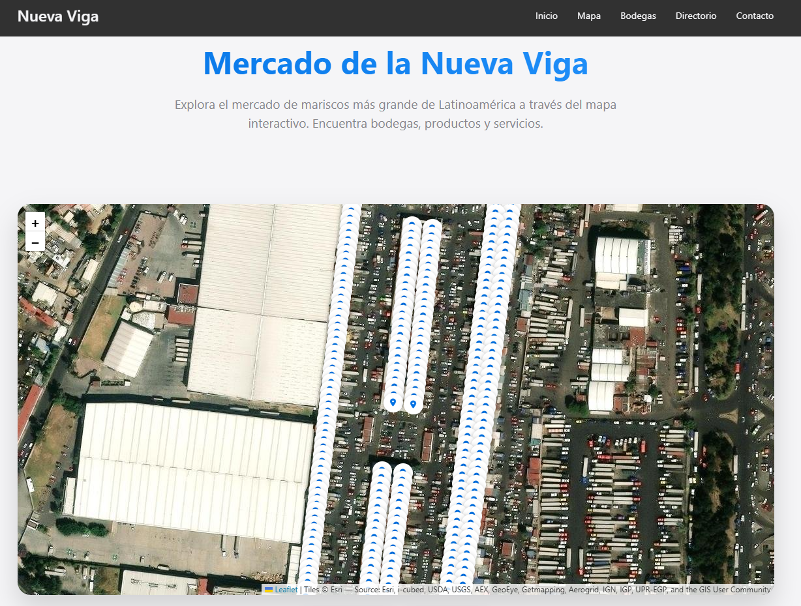
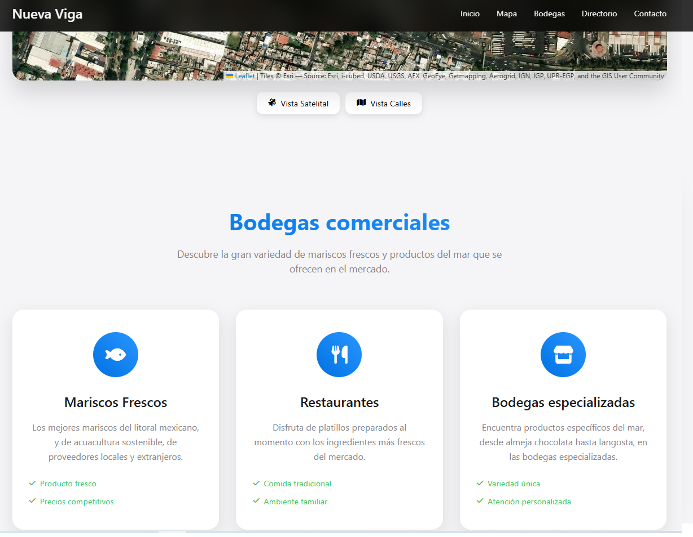
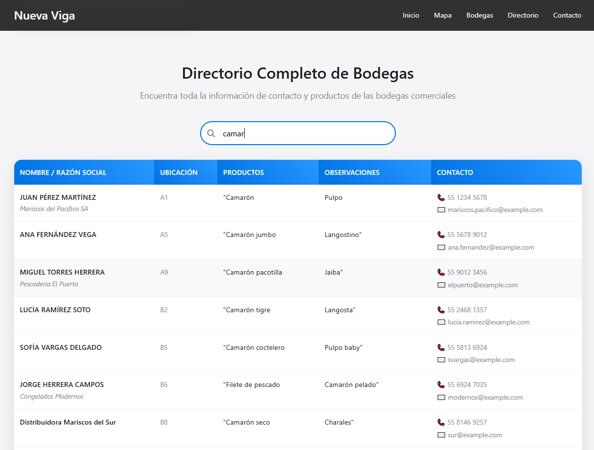
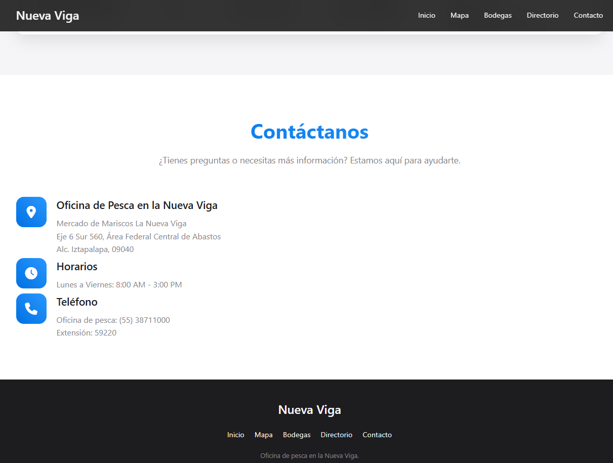

# 🐟 Mercado de la Nueva Viga - Mapa Interactivo

Un sistema web interactivo para explorar el Mercado de Mariscos La Nueva Viga, el mercado de productos del mar más grande de Latinoamérica, ubicado en la Ciudad de México.

[](https://github.com/Coyotski/dotDager/stargazers)
[](https://github.com/Coyotski/dotDager/network/members)
[](LICENSE)

## 📋 Descripción

Este proyecto presenta un mapa interactivo y un directorio completo de las bodegas comerciales del Mercado de la Nueva Viga. Los usuarios pueden:

- 🗺️ **Explorar el mapa interactivo** con ubicaciones precisas de las bodegas
- 🔍 **Buscar bodegas específicas** por nombre, producto o ubicación
- 📊 **Consultar el directorio completo** con información de contacto y productos
- 🌍 **Alternar entre vista satelital y de calles**
- 📱 **Experiencia responsive** optimizada para dispositivos móviles

## 🚀 Demo

[Ver Demo en Vivo](https://coyotski.github.io/dotDager/) *(Actualiza con tu URL de GitHub Pages)*

## 📸 Capturas de Pantalla


### Mapa Interactivo


### Directorio de Bodegas


### Otras capturas





*(Añade capturas de pantalla de tu aplicación en una carpeta `screenshots/`)*

## 🛠️ Tecnologías Utilizadas

- **HTML5** - Estructura semántica
- **CSS3** - Estilos modernos y diseño responsive
- **JavaScript (ES6+)** - Lógica de la aplicación
- **Leaflet.js** - Mapas interactivos
- **Font Awesome** - Iconografía
- **CSV** - Base de datos de bodegas

## 📁 Estructura del Proyecto

```
directorioweb/
├── index.html              # Página principal
├── styles.css             # Estilos CSS
├── script.js              # Lógica JavaScript
├── bodegascsv_demo.csv    # Base de datos de prueba (pública)
├── bodegascsv.csv         # Base de datos real (privada - no incluida)
├── locales.csv            # Datos de locales (legacy)
├── export.geojson         # Datos geográficos
├── EMAIL_SETUP.md         # Configuración de email
├── .gitignore             # Archivos ignorados por Git
└── README.md              # Documentación
```

## 🚦 Instalación y Uso

### Prerrequisitos
- Servidor web local (recomendado: Live Server para VS Code)
- Navegador web moderno

### Instalación

1. **Clona el repositorio**
   ```bash
   git clone https://github.com/Coyotski/dotDager.git
   cd dotDager
   ```

2. **Inicia un servidor local**
   
   **Opción 1: VS Code Live Server**
   - Instala la extensión "Live Server"
   - Haz clic derecho en `index.html` → "Open with Live Server"

   **Opción 2: Python**
   ```bash
   # Python 3
   python -m http.server 8000
   
   # Python 2
   python -m SimpleHTTPServer 8000
   ```

   **Opción 3: Node.js**
   ```bash
   npx serve .
   ```

3. **Abre en el navegador**
   ```
   http://localhost:8000
   ```

## 📊 Datos

### Archivos CSV de Bodegas

**Para desarrollo y demo pública:**
- `bodegascsv_demo.csv` - Contiene datos ficticios para pruebas y demostración

**Para uso en producción:**
- `bodegascsv.csv` - Datos reales (no incluido en el repositorio por privacidad)

Ambos archivos mantienen la misma estructura con las siguientes columnas:

- `NOMBRE` - Nombre del comerciante
- `RAZÓN SOCIAL` - Razón social de la empresa
- `ANDEN Y NÚMERO DE BODEGA` - Ubicación dentro del mercado
- `TELÉFONO` - Número de contacto
- `CORREO ELECTRÓNICO` - Email de contacto
- `PRODUCTO` - Productos que comercializa
- `OBSERVACIONES` - Información adicional

### Configuración de Datos

Para alternar entre datos de demo y reales, edita la línea en `script.js`:

```javascript
// Para datos de demo (público):
fetch('bodegascsv_demo.csv')

// Para datos reales (privado):
fetch('bodegascsv.csv')
```

### Archivo GeoJSON
El archivo `export.geojson` contiene las geometrías y ubicaciones geográficas para el mapa interactivo.

## 🔧 Características

### Mapa Interactivo
- 🗺️ Visualización con Leaflet.js
- 🛰️ Vista satelital y de calles
- 📍 Marcadores personalizados por tipo de bodega
- 💬 Popups informativos con detalles

### Directorio de Bodegas
- 🔍 Búsqueda en tiempo real
- 📱 Diseño responsive
- 📞 Enlaces directos para llamadas y emails
- 📊 Información completa de contacto

### Interfaz de Usuario
- 🎨 Diseño moderno y limpio
- 📱 Optimizado para móviles
- ⚡ Carga rápida
- 🧭 Navegación intuitiva

## 🤝 Contribuciones

Las contribuciones son bienvenidas. Para contribuir:

1. Fork el proyecto
2. Crea una rama para tu feature (`git checkout -b feature/AmazingFeature`)
3. Commit tus cambios (`git commit -m 'Add some AmazingFeature'`)
4. Push a la rama (`git push origin feature/AmazingFeature`)
5. Abre un Pull Request

### 📝 Guías de Contribución

- Mantén el código limpio y comentado
- Sigue las convenciones de nomenclatura existentes
- Actualiza la documentación cuando sea necesario
- Prueba tus cambios antes de enviar el PR

## 📄 Licencia

Este proyecto está bajo la Licencia MIT. Ver el archivo [LICENSE](LICENSE) para más detalles.

## 👥 Autores

- **César** - *Desarrollo inicial* - [@Coyotski](https://github.com/Coyotski)

## 🙏 Agradecimientos

- Oficina de Pesca en la Nueva Viga
- Mercado de Mariscos La Nueva Viga
- Comunidad de desarrolladores de Leaflet.js
- Contributors y testers

## 📞 Contacto

- **Email**: crciq2010@gmail.com
- **Proyecto**: [https://github.com/Coyotski/dotDager](https://github.com/Coyotski/dotDager)
- **Issues**: [https://github.com/Coyotski/dotDager/issues](https://github.com/Coyotski/dotDager/issues)

## 📈 Estado del Proyecto

- ✅ Mapa interactivo funcional
- ✅ Directorio de bodegas completo
- ✅ Diseño responsive
- ✅ Búsqueda en tiempo real
- 🔄 Mejoras continuas en desarrollo

## 🗺️ Roadmap

- [ ] Integración con APIs de redes sociales
- [ ] Sistema de favoritos
- [ ] Filtros avanzados por tipo de producto
- [ ] Modo offline
- [ ] App móvil nativa
- [ ] Sistema de reviews y calificaciones

---

## 📊 Información del Mercado

### Mercado de la Nueva Viga
- **Ubicación**: Eje 6 Sur 560, Área Federal Central de Abastos, Alc. Iztapalapa, 09040, CDMX
- **Horarios**: Lunes a Viernes: 8:00 AM - 3:00 PM
- **Teléfono**: (55) 38711000 Ext. 59220

**El mercado de mariscos más grande de Latinoamérica** 🌎

---

⭐ **¡Dale una estrella si este proyecto te fue útil!** ⭐
